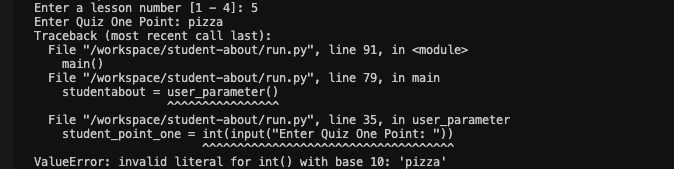
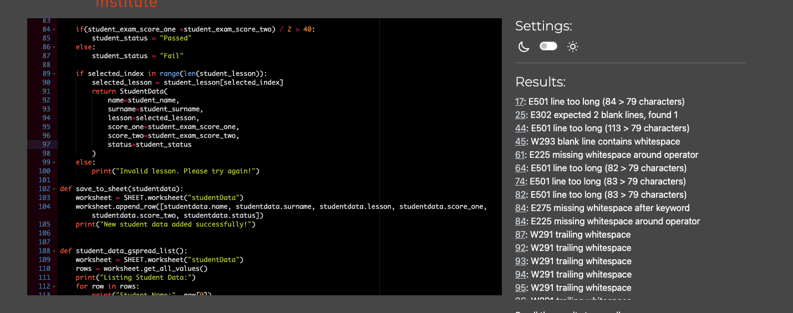
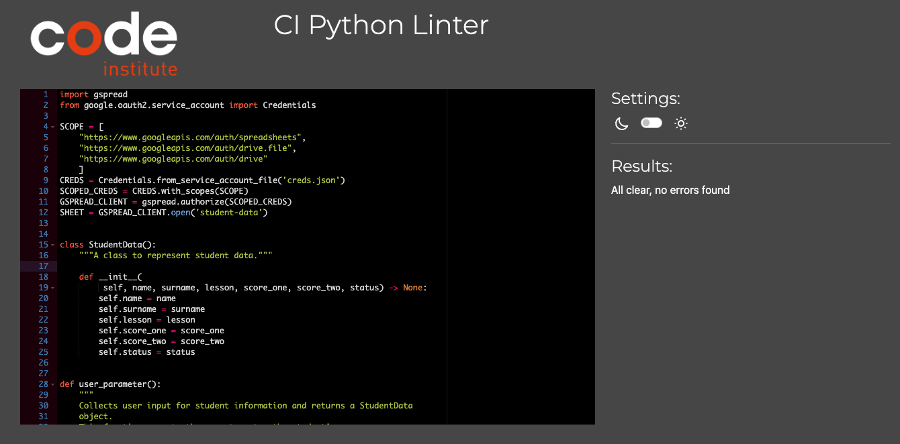

# **Student Data**

# Testing

The testing approach is as follows:

1. Manual testing of user stories
2. Automated unit testing using the Python unittest library

## **Manuel testing**

I performed manual tests in this project as follows:

# *User stories testing

### **__Inputs:__**

In this project's input sections, I've conducted thorough testing to anticipate errors that might result
from user input. I've focused on scenarios prone to errors, such as entering a number instead of 
a required string and managing special characters. I've implemented extensive input validation across 
all user inputs to guarantee robust error handling.

The user is required to enter only the desired numbers and letters that are in the menu. If it does not enter, 
the following error message is displayed:

## Browser Compatibility

- Google Chrome
- Microsoft Edge
- Safari
- Mozilla Firefox

Appearance and functionality appear to be consistent throughout all browsers.

## **__Bugs and fixes:_**

1. In the user_parameter function:
Fixed an indentation issue with the else block inside the while loop for validating lesson numbers.
Initialized the selected_index variable outside the loop to avoid a NameError if the loop doesn't run 
initially (when user_input.isdigit() is initially False).

2. As a result of PEP8 verification, the following issues were detected:

# **_PEP8 Python Linter:_**

Below are screenshots of the result I received from the Python linter for the `run.py` file:

After resolving all problems in the `run.py` file, no more errors were produced.

How did I fix it?

- I removed all the white spaces and blank lines.
- I encountered an error because the lines were too long. I arranged the lines according to the desired length.
 And I checked the indentations.

