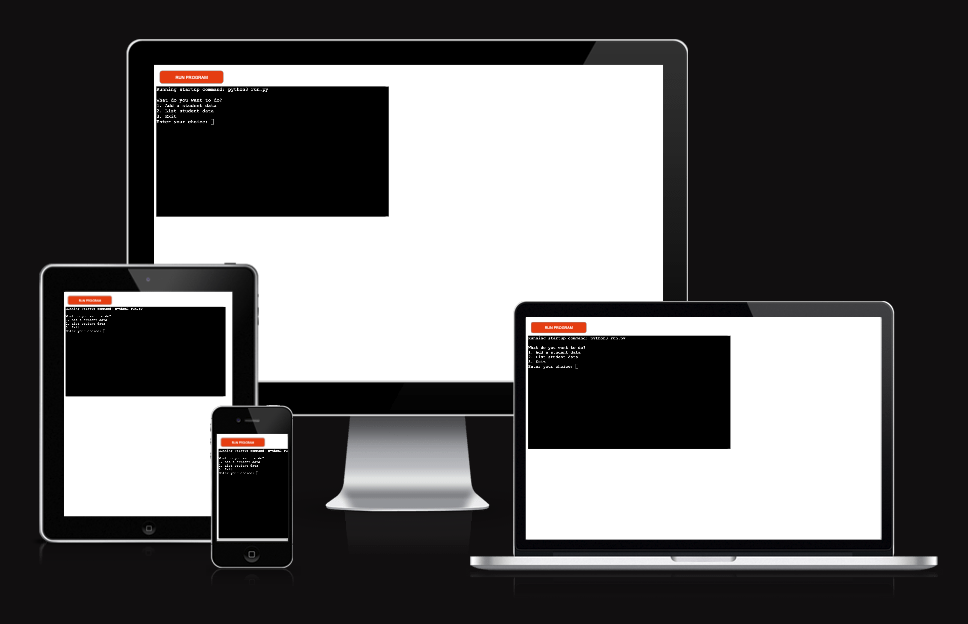
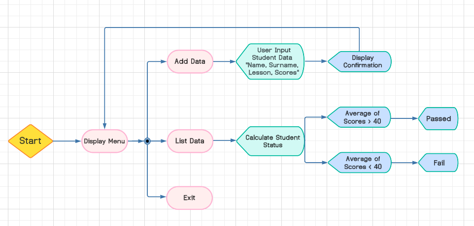
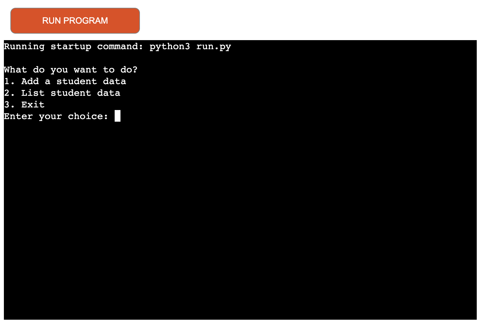
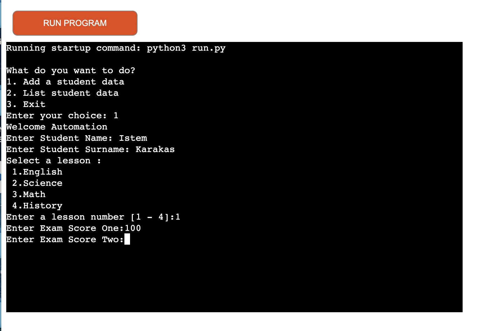
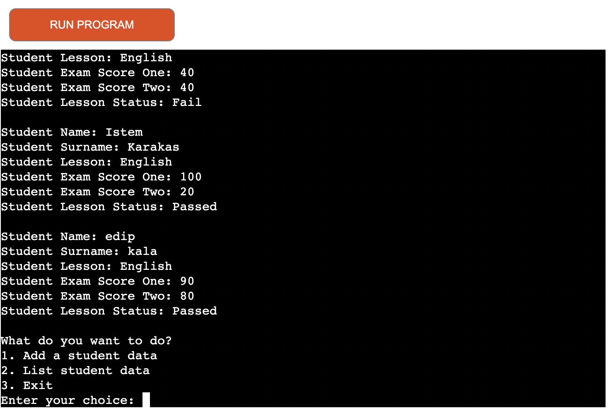
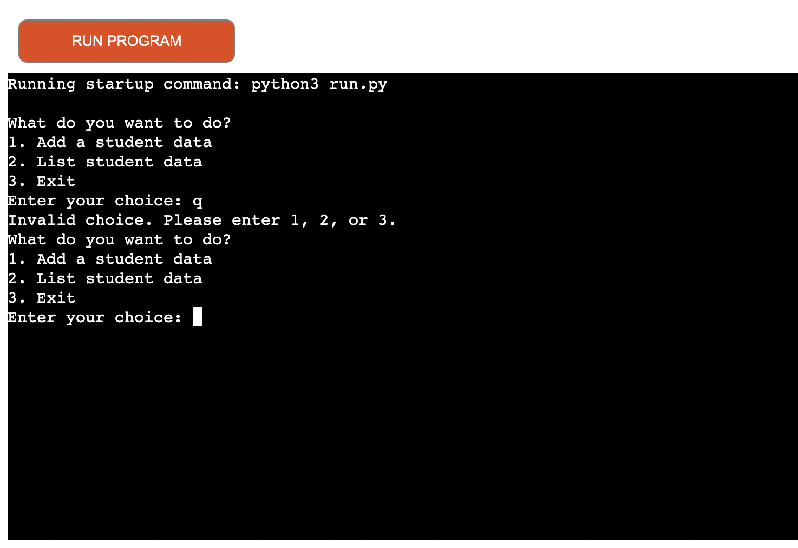
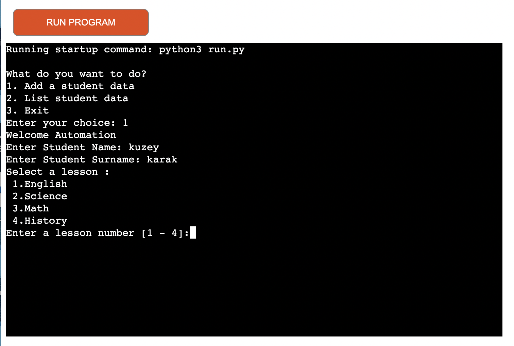
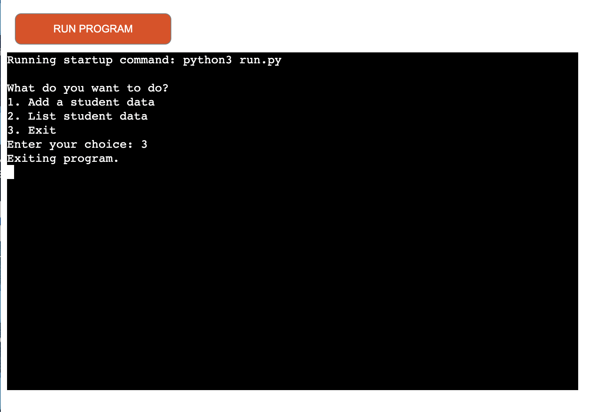
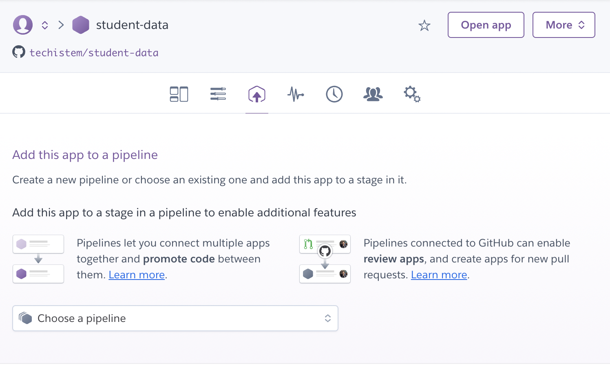

# **Student Data**

## **Overview**

This Student Data program is useful for teachers or administrators to manage student records easily. They can add new student data, view existing data, 
and have it all organized neatly in a Google Sheet.

It is built using Python and runs through the Code institute mock terminal on Heroku.

Welcome to <a href="https://student-data-706119549c09.herokuapp.com/" target="_blank" rel="noopener">Student Data</a>

# **Planing Stage**

## **_User Stories:_**

As a user, I want to be able to:

1. As an administrator,
I want to add a new student's data so that their information is stored in the system.
2. As a teacher,
I want to view a list of all student data so that I can have an overview of all students in the system.
3. As a teacher,
I want to calculate a student's average grade so that I can assess their performance in the course.
4. As a teacher,
I want to filter students by lesson so that I can view the performance of students in a specific lesson.
5. As an administrator,
I want to update a student's information so that the data in the system remains accurate.
6. As an administrator,
I want to delete a student's data so that their information is removed from the system.

## **_Site Aims:_**

The site aims to:

1. Users can input student information, including name, surname, lesson, and exam scores.
2. Users can list and display student data from Google Sheets worksheet.
3. Describes how the program saves the entered student data to the worksheet.
4. Users are encouraged to provide feedback or report issues for program improvement.

## **_Path to Achieve:_** 

To achieve the above, the site will:

1. When the user enters information that is not valid, a message should appear on the screen explaining what to do and how to continue.
2. Create an option so that the user can check the information they enter.
3. Provide the user with the opportunity to easily view and delete the information they enter.

## **_Student Data Flow Chart:_**

I created the following flow chart using [lucid charts] (https://www.lucidchart.com/) to outline the necessary steps for programming
the student data recording system.

  

# **Features**

This Python program allows users to manage and record student data using Google Sheets.
The features included in this programme are listed in the main menu and they can be seen below:

## **Add student data:**

When the user selects the add new student option, the program will be asked to enter student information.

## **List Student Data**

- The program can list and display student data from the Google Sheets worksheet.
- Accordingly, the student's name, surname, course, and average exam 
scores are reflected on the screen.
- The system automatically calculates the student's status (Pass/Fail) based on their exam scores.

### **Google Sheets Integration**

Utilizes Google Sheets API for data storage and retrieval.

### **Validated Input** 

Input validation ensures correct data entry, prompting users when invalid input is provided.

### **Flexible Lesson Selection**

Users can select from a list of predefined lessons: English, Science, Math, and History.

### **Feedback and Error Handling**

The program provides feedback on successful data entry and error messages for invalid inputs.

### **Exit**

Users can exit the program at any time.

# **Future-Enhancements**

Here are some potential improvements and features that I could add to enhance the functionality of the program:

- **User Authentication**: I can implement user authentication to ensure only authorized users can access and modify student data.
  
- **Search and Filter**: I can add functionality to search for specific students or filter students by criteria such as lesson, score, or status.

- **Update and Delete**: I can include options to update and delete student records directly from the program interface.

- **Data Visualization**: I can integrate data visualization tools to create charts and graphs for better data analysis and insights.

- **Email Notifications**: I can send automated email notifications to teachers or administrators for important events, such as new student entries or low scores.

- **CSV Import/Export**: I can allow users to import student data from CSV files and export data to CSV for easy sharing and backup.

- **Mobile App**: I can develop a mobile app version of the program for convenient access on smartphones and tablets.

These enhancements could make the program more versatile, user-friendly, and efficient for managing student data.

# **Technologies Used**

I have used several technologies that have enabled this design to work:

-[Python](https://www.python.org/)
- The entirety of the code in this application is composed using Python as the fundamental programming language, ensuring its complete functionality.
    - In addition to core Python I have used the following Python modules:
        - [Gspread](https://docs.gspread.org/en/latest/)
            - Used to access my google sheets document throughout the application, to access and edit data.
        - [Google Auth](https://google-auth.readthedocs.io/en/master/)
            - Used to provide access to the application to interact with my google sheet.
- [GitHub](https://github.com/)
    - Used to store code for the project after being pushed.
- [Git](https://git-scm.com/)
    - Used for version control by utilising the Gitpod terminal to commit to Git and Push to GitHub.
- [Gitpod](https://www.gitpod.io/)
    - Used as the development environment.
- [Heroku](https://dashboard.heroku.com/apps)
    - Used to deploy my application.
- [Lucid](https://lucid.app/documents#/dashboard)
    - Used to create the flowchart for the project.
- [Grammarly](https://www.grammarly.com/)
    - Used to fix the grammar errors across the project.
- [Google Sheets](https://www.google.co.uk/sheets/about/)
    - Used to store the 'Contacts' data used for the application.
- [Pep8](https://pep8ci.herokuapp.com/)
    - Used to test my code for any issues or errors.

# **Testing Phase**

I have written my testing in a different file for both during-development and post-development called [TESTING.md](TESTING.md).

# **Libraries**

For this project to function, I imported the following libraries:

- gspread: Used for accessing Google Sheets API.
- google-auth: Provides authentication credentials for accessing Google APIs.

# **Deployment to Heroku**

The project was deployed to [Heroku](https://www.heroku.com)

1. _Log in to Heroku_ or create an account if required.
2. _Click on the dashboard_ from the hamburger menu on the top right to be navigated to the apps page.
3. _Click the new_ button on the top right of the page.
4. _Select the "create new app"_ option.
5. _Enter_ the app name. I named mine student-data (this has to be unique).
6. _Once Heroku accepts the app name_ select your region.
7. Click the purple _Create app button_ when you are ready to proceed.
8. This will bring you to the project _Deploy_ tab. From here, navigate to the _settings tab_ and scroll down to the _Config Vars_ section.
9. _Click_ the button labeled _Reveal_Config Vars_, _Enter_ the key as Port, the Value as 8000 and _Click the add button_.
10. Scroll down to the _buildpacks section_ of the settings page, click the button labeled Add buildpack, select Python, and click _Save Changes_.
11. _Repeat step 10_ but this time add node.js instead of python.
    - Remember to keep the buildpacks in the correct order, Python first and Node second.
12. _Scroll back to the top_ of the settings page, and navigate to the _Deploy_ tab.
13. From the deploy tab select _Github as the deployment_ method.
14. _Confirm_ you want to connect to GitHub.
15. _Search_ for the repository name and _click the connect button_ next to the intended repository.
16. From the bottom of the deploy page _select your preferred deployment type_ by following one of the steps below:
    - Clicking either "Enable Automatic Deploys" for automatic deployment when you push updates to GitHub.
    - Select the correct branch for deployment from the drop-down menu and click the "Deploy Branch" button for manual deployment.

## **Using Github & Gitpod**

To deploy my command-line interface application, I had to use the 
[Code Institute Python Essentials Template](https://github.com/Code-Institute-Org/python-essentials-template),
as this enables the application to be properly viewed on Heroku using a mock terminal.

- Click the `Use This Template` button.
- Add a repository name and brief description.
- Click the `Create Repository from Template` to create your repository.
- To create a Gitpod workspace you then need to click `Gitpod`, this can take a few minutes.
- When you want to work on the project it is best to open the workspace from Gitpod (rather than Github) as this will open your previous 
workspace rather than creating a new one. You should pin the workspace so that it isn't deleted.
- Committing your work should be done often and should have clear/explanatory messages, use the following commands to make your commits:
    - `git add .`: adds all modified files to a staging area
    - `git commit -m "A message explaining your commit"`: commits all changes to a local repository.
    - `git push`: pushes all your committed changes to your Github repository.

*Forking the GitHub Repository*

If you want to make changes to your repository without affecting it, you can make a copy of it by 'Forking' it. This ensures your original 
repository remains unchanged.

1. Find the relevant GitHub repository
2. In the top right corner of the page, click the Fork button (under your account)
3. Your repository has now been 'Forked' and you have a copy to work on

*Cloning the GitHub Repository*

Cloning your repository will allow you to download a local version of the repository to be worked on. Cloning can also be a great way
to backup your work.

1. Find the relevant GitHub repository
2. Press the arrow on the Code button
3. Copy the link that is shown in the drop-down
4. Now open Gitpod & select the directory location where you would like the clone created
5. In the terminal type 'git clone' & then paste the link you copied in GitHub
6. Press enter and your local clone will be created.

# **Cedits**

- [Google Sheets API](https://developers.google.com/sheets/api/guides/concepts) Utilized for storing and retrieving student data.
- [lucidchart.com](https://www.lucidchart.com/pages/) was used to create the programme flow chart "student-data-flowchart.png"
- [Code Institute's](https://codeinstitute.net/full-stack-software-development-diploma/?nab=2) LMS (Learning Management System) 
for teaching me Python to begin with.
- [Code Institute's](https://codeinstitute.net/full-stack-software-development-diploma/?nab=2) LMS (Learning Management System) 
for teaching me Python to begin with.
- Peer-code-review channel in [Code Institute's](https://codeinstitute.net/full-stack-software-development-diploma/?nab=2) Slack community for helping me find bugs and issues.
[Python tips book](https://book.pythontips.com/en/latest/) helped me gain knowledge about Python I otherwise would not have obtained.

        

